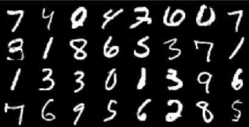

# DCGAN Implementation for MNIST Dataset

This repository contains a PyTorch implementation of a Deep Convolutional Generative Adversarial Network (DCGAN) applied to the MNIST dataset. DCGAN is a type of GAN that utilizes convolutional neural networks as both the generator and discriminator to generate realistic images.

## Overview

The code provided here includes:

- Implementation of the DCGAN model architecture (`Generator` and `Discriminator`) as specified in the original paper.
- Training script using PyTorch to train the DCGAN on the MNIST dataset.
- Testing functions to ensure proper functionality of the implemented model.

## Requirements

- Python 3.x
- PyTorch

## Usage

### Training

To train the DCGAN model on the MNIST dataset, run the training script `train_dcgan.py`. The script will automatically download the MNIST dataset if not available locally and start the training process. In this sample code, the model is trained for 5 epochs. The results are as follows:

#### Real Images of MNIST Dataset:


#### DCGAN Generated Images


To train the images, open cmd in the model directory and type:
```bash
python train_dcgan.py
```

The image results are taken using Tensorboard. To open tensorboard, type:
```bash
tensorboard --logdir=runs
```

## Model Architecture
The DCGAN consists of two main components:

Generator: This network takes random noise as input and generates images.
Discriminator: This network discriminates between real and generated images.
The architecture details for both components are available in the respective Python files: dcgan.py.


The above image is a representation of Generator Network of DCGAN (_Image taken from DCGAN paper_)

## Testing
To ensure that the model components (Generator and Discriminator) function correctly, there are test functions available in the script dcgan.py. Uncomment the test() function calls in the script to perform the tests.
```bash
python dcgan.py
```

## Acknowledgments
This implementation is based on the DCGAN paper by Radford et al. [Unsupervised Representation Learning with Deep Convolutional Generative Adversarial Networks](https://arxiv.org/abs/1511.06434)

## Contributions and Issues
Feel free to contribute to this repository by opening issues or submitting pull requests. Your feedback and suggestions are welcome!
